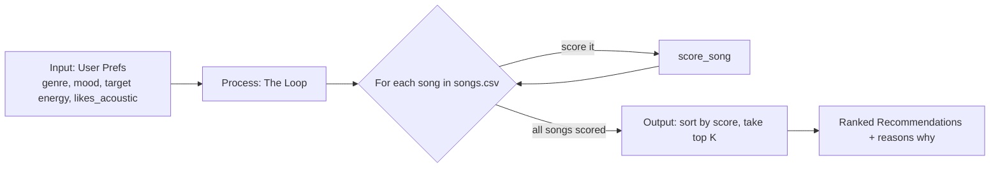

# 🎵 Music Recommender Simulation

## Project Summary

In this project you will build and explain a small music recommender system.

Your goal is to:

- Represent songs and a user "taste profile" as data
- Design a scoring rule that turns that data into recommendations
- Evaluate what your system gets right and wrong
- Reflect on how this mirrors real world AI recommenders

Replace this paragraph with your own summary of what your version does.

---

## How The System Works

From what I looked into, real recommenders like Spotify or YouTube mostly do two things: they look at what other people with similar taste liked (collaborative filtering), and they look at what a song actually sounds like (content-based filtering), then mix both together. My version is way smaller, so I'm only doing the content-based part. Instead of comparing users to other users, I just compare each song's stats to what one user says they like, and I give higher scores to songs that are closer to what they asked for, not just songs that are "higher energy" or whatever.

**Song features I'm using:**
- `genre` — matched exact, used more like a filter/bonus than a real "closeness" number
- `mood` — same, exact match bonus
- `energy` — closeness score vs the user's target energy
- `valence` — how positive/happy the song sounds
- `danceability` — how easy it is to move to
- `acousticness` — how "unplugged" vs produced/electronic it sounds
- (dropping `tempo_bpm` from the score itself since it basically tracks energy already and would just double count)

**UserProfile stores:**
- `favorite_genre`
- `favorite_mood`
- `target_energy` — the energy level they want, not just "give me high energy"
- `likes_acoustic` — a simple yes/no on acoustic songs

**How the Recommender scores a song:**
For the numeric stuff (like energy), I use `1 - abs(song_value - target_value)` so a song that lands right on what the user wants scores near 1, and it drops off the further away it gets in either direction. Genre and mood add a bonus on top if they match exactly. Then all of that gets added into one score per song.

**How I pick which songs to show:**
Once every song has a score, the Recommender sorts the whole list from highest to lowest and just takes the top `k`. That sorting/cutoff step is separate from the scoring itself — scoring only looks at one song at a time, ranking is what decides the final order and how many make the list.

**Data flow, the quick map:**



Basically: prefs come in once, then every song in the CSV gets judged one at a time against those prefs, and once they all have a score I sort and cut it down to the top K.

**Algorithm Recipe (finalized):**

I went with genre counting for more than mood, 2 to 1. Reasoning is a wrong genre feels like a bigger miss than a wrong mood — like if you want afrobeats and I hand you rock, that's way off, but if you want "romantic" and I hand you "playful" afrobeats, it's still kinda in the ballpark. Mood also just changes more day to day than genre does, so I didn't want it weighted the same.

- Genre match: `+2.0` if it's exact
- Mood match: `+1.0` if it's exact
- Energy closeness: up to `+1.0`, scaled by `1 - abs(song.energy - target_energy)` so close energy still gets partial credit instead of all-or-nothing
- Acoustic fit: `+0.5` if `acousticness` lines up with whether the user said they like acoustic stuff or not (small bonus, more of a tiebreaker)

Max possible score is 4.5. All of it just adds up into one number per song.

**Bias I'm expecting:**
Because genre is worth double mood, this thing probably over-favors genre matches even when the mood is way off. So a song could beat out a better mood fit just because the genre box got checked. Also since acoustic is only worth 0.5, it barely moves the ranking, so users who really care about acoustic vs not might feel like the system's ignoring them. And energy being a smooth score means a song that's just "fine" on everything can sometimes out-score a song that nails genre + mood but is a little off on energy.

---

## Getting Started

### Setup

1. Create a virtual environment (optional but recommended):

   ```bash
   python -m venv .venv
   source .venv/bin/activate      # Mac or Linux
   .venv\Scripts\activate         # Windows

2. Install dependencies

```bash
pip install -r requirements.txt
```

3. Run the app:

```bash
python -m src.main
```

### Running Tests

Run the starter tests with:

```bash
pytest
```

You can add more tests in `tests/test_recommender.py`.

---

## Sample Recommendation Output

Ran with `python -m src.main`, default profile is `favorite_genre=afrobeats, favorite_mood=romantic, target_energy=0.6, likes_acoustic=False`:

```
Loaded songs: 17

Top 5 Recommendations for afrobeats / romantic
==============================================

1. Essence — Wizkid ft. Tems
   Score:   4.45
   Reasons: genre match (+2.0); mood match (+1.0); energy similarity (+0.95); acoustic fit (+0.5)

2. Last Last — Burna Boy
   Score:   3.50
   Reasons: genre match (+2.0); energy similarity (+1.00); acoustic fit (+0.5)

3. Calm Down — Rema
   Score:   3.48
   Reasons: genre match (+2.0); energy similarity (+0.98); acoustic fit (+0.5)

4. HUMBLE. — Kendrick Lamar
   Score:   1.48
   Reasons: energy similarity (+0.98); acoustic fit (+0.5)

5. Night Drive Loop — Neon Echo
   Score:   1.35
   Reasons: energy similarity (+0.85); acoustic fit (+0.5)
```

**Screenshot or video** *(optional)*: <!-- Insert a screenshot or demo video link here -->

---

## Experiments You Tried

Use this section to document the experiments you ran. For example:

- What happened when you changed the weight on genre from 2.0 to 0.5
- What happened when you added tempo or valence to the score
- How did your system behave for different types of users

### Feature Removal: disabling the mood check

Commented out the `MOOD_WEIGHT` block in all three places it appears (`Recommender._score`, `Recommender.explain_recommendation`, and the functional `score_song`), leaving genre match, energy closeness, and acoustic fit as the only contributors. Max possible score dropped from 4.5 to 3.5; no term can go negative, so the math stays valid — it's a straight subtraction of one additive term, not a rescaling.

Ran `python -m src.main` again with the same default profile (`favorite_genre=afrobeats, favorite_mood=romantic, target_energy=0.6, likes_acoustic=False`):

```
Loaded songs: 17

Top 5 Recommendations for afrobeats / romantic
==============================================

1. Last Last — Burna Boy
   Score:   3.50
   Reasons: genre match (+2.0); energy similarity (+1.00); acoustic fit (+0.5)

2. Calm Down — Rema
   Score:   3.48
   Reasons: genre match (+2.0); energy similarity (+0.98); acoustic fit (+0.5)

3. Essence — Wizkid ft. Tems
   Score:   3.45
   Reasons: genre match (+2.0); energy similarity (+0.95); acoustic fit (+0.5)

4. HUMBLE. — Kendrick Lamar
   Score:   1.48
   Reasons: energy similarity (+0.98); acoustic fit (+0.5)

5. Night Drive Loop — Neon Echo
   Score:   1.35
   Reasons: energy similarity (+0.85); acoustic fit (+0.5)
```

**Baseline for comparison** (mood check enabled, same profile — see [Sample Recommendation Output](#sample-recommendation-output) above): #1 was Essence (4.45), #2 Last Last (3.50), #3 Calm Down (3.48).

**What changed:** the same 5 songs still make the top 5 — genre match was already carrying most of the weight — but **Essence dropped from #1 to #3**. Essence was the only song whose mood ("romantic") matched the user's `favorite_mood`, so its +1.0 mood bonus was the entire reason it beat Last Last and Calm Down. With mood removed, the three afrobeats songs are now ranked purely by which one's energy sits closest to `target_energy=0.6`, and Essence has the largest energy gap (0.55 vs Last Last's 0.60 and Calm Down's 0.62).

**More accurate or just different?** Just different — arguably *less* accurate for this profile. The user explicitly said they like "romantic" mood, and removing that check threw away a real preference signal, silently downgrading the one song that matched it on a dimension the user actually cares about. It confirms mood is doing real, non-redundant work in the scoring — it's not just noise riding on top of genre. `tests/test_recommender.py` still passes after the change only because its assertions don't check mood-driven ordering, which is a gap in the starter test coverage, not proof the removal is harmless. Reverted the comment-outs afterward — mood check is back in the main logic below.

---

## Adversarial / Edge Case Testing

Ran `recommend_songs()` directly against `data/songs.csv` for a batch of profiles designed to try to break or confuse the scoring logic (conflicting preferences, boundary values, out-of-range input, unknown categories, and case mismatches). Terminal output below, unedited.

**Conflicting preferences: afrobeats + heartbroken mood, but wants energy=0.95**
Mood ("heartbroken") only shows up on a low-energy song, but the requested energy is near-max — genre alone still wins.

```
Profile: Conflicting: afrobeats/heartbroken but wants max energy
----------------------------------------------------------------
prefs = {'favorite_genre': 'afrobeats', 'favorite_mood': 'heartbroken', 'target_energy': 0.95, 'likes_acoustic': False}
1. Last Last — Burna Boy
   Score:   4.15
   Reasons: genre match (+2.0); mood match (+1.0); energy similarity (+0.65); acoustic fit (+0.5)
2. Calm Down — Rema
   Score:   3.17
   Reasons: genre match (+2.0); energy similarity (+0.67); acoustic fit (+0.5)
3. Essence — Wizkid ft. Tems
   Score:   3.10
   Reasons: genre match (+2.0); energy similarity (+0.60); acoustic fit (+0.5)
4. Gym Hero — Max Pulse
   Score:   1.48
   Reasons: energy similarity (+0.98); acoustic fit (+0.5)
5. Storm Runner — Voltline
   Score:   1.46
   Reasons: energy similarity (+0.96); acoustic fit (+0.5)
```

**Conflicting preferences: jazz + hype mood, but wants low energy (0.35)**
"Hype" only appears on a high-energy hip hop track, while jazz in this catalog is calm — the two preferences point at completely different songs.

```
Profile: Conflicting: jazz/hype but wants low energy
----------------------------------------------------
prefs = {'favorite_genre': 'jazz', 'favorite_mood': 'hype', 'target_energy': 0.35, 'likes_acoustic': False}
1. Coffee Shop Stories — Slow Stereo
   Score:   2.98
   Reasons: genre match (+2.0); energy similarity (+0.98)
2. Sicko Mode — Travis Scott
   Score:   2.02
   Reasons: mood match (+1.0); energy similarity (+0.52); acoustic fit (+0.5)
3. Adorn — Miguel
   Score:   1.40
   Reasons: energy similarity (+0.90); acoustic fit (+0.5)
4. Essence — Wizkid ft. Tems
   Score:   1.30
   Reasons: energy similarity (+0.80); acoustic fit (+0.5)
5. Last Last — Burna Boy
   Score:   1.25
   Reasons: energy similarity (+0.75); acoustic fit (+0.5)
```

**Boundary: acousticness sits exactly at the 0.5 threshold**
Checks that `acousticness > ACOUSTIC_THRESHOLD` treats exactly 0.5 as *not* acoustic (strict `>`, not `>=`).

```
Profile: Boundary: acousticness exactly 0.5 threshold, mid energy
-----------------------------------------------------------------
prefs = {'favorite_genre': 'pop', 'favorite_mood': 'happy', 'target_energy': 0.5, 'likes_acoustic': True}
1. Sunrise City — Neon Echo
   Score:   3.68
   Reasons: genre match (+2.0); mood match (+1.0); energy similarity (+0.68)
2. Gym Hero — Max Pulse
   Score:   2.57
   Reasons: genre match (+2.0); energy similarity (+0.57)
3. Rooftop Lights — Indigo Parade
   Score:   1.74
   Reasons: mood match (+1.0); energy similarity (+0.74)
4. Midnight Coding — LoRoom
   Score:   1.42
   Reasons: energy similarity (+0.92); acoustic fit (+0.5)
5. Focus Flow — LoRoom
   Score:   1.40
   Reasons: energy similarity (+0.90); acoustic fit (+0.5)
```

**Extreme: target_energy = 0.0**

```
Profile: Extreme: target_energy = 0.0
-------------------------------------
prefs = {'favorite_genre': 'ambient', 'favorite_mood': 'chill', 'target_energy': 0.0, 'likes_acoustic': True}
1. Spacewalk Thoughts — Orbit Bloom
   Score:   4.22
   Reasons: genre match (+2.0); mood match (+1.0); energy similarity (+0.72); acoustic fit (+0.5)
2. Library Rain — Paper Lanterns
   Score:   2.15
   Reasons: mood match (+1.0); energy similarity (+0.65); acoustic fit (+0.5)
3. Midnight Coding — LoRoom
   Score:   2.08
   Reasons: mood match (+1.0); energy similarity (+0.58); acoustic fit (+0.5)
4. Best Part — Daniel Caesar ft. H.E.R.
   Score:   1.20
   Reasons: energy similarity (+0.70); acoustic fit (+0.5)
5. Coffee Shop Stories — Slow Stereo
   Score:   1.13
   Reasons: energy similarity (+0.63); acoustic fit (+0.5)
```

**Extreme: target_energy = 1.0**

```
Profile: Extreme: target_energy = 1.0
-------------------------------------
prefs = {'favorite_genre': 'hip hop', 'favorite_mood': 'hype', 'target_energy': 1.0, 'likes_acoustic': False}
1. Sicko Mode — Travis Scott
   Score:   4.33
   Reasons: genre match (+2.0); mood match (+1.0); energy similarity (+0.83); acoustic fit (+0.5)
2. HUMBLE. — Kendrick Lamar
   Score:   3.12
   Reasons: genre match (+2.0); energy similarity (+0.62); acoustic fit (+0.5)
3. Gym Hero — Max Pulse
   Score:   1.43
   Reasons: energy similarity (+0.93); acoustic fit (+0.5)
4. Storm Runner — Voltline
   Score:   1.41
   Reasons: energy similarity (+0.91); acoustic fit (+0.5)
5. Sunrise City — Neon Echo
   Score:   1.32
   Reasons: energy similarity (+0.82); acoustic fit (+0.5)
```

**Out-of-domain input: target_energy = 1.5 (invalid, above the [0,1] range the data uses)**
`max(0.0, 1 - abs(gap))` clamps gracefully instead of throwing or going negative, but nothing in the code validates that `target_energy` was even a legal value in the first place.

```
Profile: Out-of-domain: target_energy = 1.5 (invalid input)
-------------------------------------------------------------
prefs = {'favorite_genre': 'rock', 'favorite_mood': 'intense', 'target_energy': 1.5, 'likes_acoustic': False}
1. Storm Runner — Voltline
   Score:   3.91
   Reasons: genre match (+2.0); mood match (+1.0); energy similarity (+0.41); acoustic fit (+0.5)
2. Gym Hero — Max Pulse
   Score:   1.93
   Reasons: mood match (+1.0); energy similarity (+0.43); acoustic fit (+0.5)
3. Sicko Mode — Travis Scott
   Score:   0.83
   Reasons: energy similarity (+0.33); acoustic fit (+0.5)
4. Sunrise City — Neon Echo
   Score:   0.82
   Reasons: energy similarity (+0.32); acoustic fit (+0.5)
5. Rooftop Lights — Indigo Parade
   Score:   0.76
   Reasons: energy similarity (+0.26); acoustic fit (+0.5)
```

**Out-of-domain input: target_energy = -0.3 (invalid, below the [0,1] range)**

```
Profile: Out-of-domain: target_energy = -0.3 (invalid input)
--------------------------------------------------------------
prefs = {'favorite_genre': 'lofi', 'favorite_mood': 'chill', 'target_energy': -0.3, 'likes_acoustic': True}
1. Library Rain — Paper Lanterns
   Score:   3.85
   Reasons: genre match (+2.0); mood match (+1.0); energy similarity (+0.35); acoustic fit (+0.5)
2. Midnight Coding — LoRoom
   Score:   3.78
   Reasons: genre match (+2.0); mood match (+1.0); energy similarity (+0.28); acoustic fit (+0.5)
3. Focus Flow — LoRoom
   Score:   2.80
   Reasons: genre match (+2.0); energy similarity (+0.30); acoustic fit (+0.5)
4. Spacewalk Thoughts — Orbit Bloom
   Score:   1.92
   Reasons: mood match (+1.0); energy similarity (+0.42); acoustic fit (+0.5)
5. Best Part — Daniel Caesar ft. H.E.R.
   Score:   0.90
   Reasons: energy similarity (+0.40); acoustic fit (+0.5)
```

**Nonexistent genre/mood ("metal" / "euphoric" — not in the catalog at all)**
Neither bonus can ever fire; ranking collapses to pure energy-closeness + acoustic fit, and results feel arbitrary rather than tailored.

```
Profile: Nonexistent genre/mood in catalog
------------------------------------------
prefs = {'favorite_genre': 'metal', 'favorite_mood': 'euphoric', 'target_energy': 0.6, 'likes_acoustic': False}
1. Last Last — Burna Boy
   Score:   1.50
   Reasons: energy similarity (+1.00); acoustic fit (+0.5)
2. Calm Down — Rema
   Score:   1.48
   Reasons: energy similarity (+0.98); acoustic fit (+0.5)
3. HUMBLE. — Kendrick Lamar
   Score:   1.48
   Reasons: energy similarity (+0.98); acoustic fit (+0.5)
4. Essence — Wizkid ft. Tems
   Score:   1.45
   Reasons: energy similarity (+0.95); acoustic fit (+0.5)
5. Night Drive Loop — Neon Echo
   Score:   1.35
   Reasons: energy similarity (+0.85); acoustic fit (+0.5)
```

**Case mismatch: `"Pop"` / `"Happy"` vs the CSV's lowercase `"pop"` / `"happy"`**
Bug found: the exact-string `==` comparison is case-sensitive, so this produces the *identical* ranking as the "nonexistent genre" profile above — a real user typing "Pop" instead of "pop" silently loses all genre/mood credit with no error or warning.

```
Profile: Case mismatch: 'Pop' vs stored 'pop'
---------------------------------------------
prefs = {'favorite_genre': 'Pop', 'favorite_mood': 'Happy', 'target_energy': 0.8, 'likes_acoustic': False}
1. Sunrise City — Neon Echo
   Score:   1.48
   Reasons: energy similarity (+0.98); acoustic fit (+0.5)
2. Sicko Mode — Travis Scott
   Score:   1.47
   Reasons: energy similarity (+0.97); acoustic fit (+0.5)
3. Rooftop Lights — Indigo Parade
   Score:   1.46
   Reasons: energy similarity (+0.96); acoustic fit (+0.5)
4. Night Drive Loop — Neon Echo
   Score:   1.45
   Reasons: energy similarity (+0.95); acoustic fit (+0.5)
5. Storm Runner — Voltline
   Score:   1.39
   Reasons: energy similarity (+0.89); acoustic fit (+0.5)
```

**Empty string genre/mood (`""`, `""`)**
Same collapse-to-energy-only behavior as the nonexistent-category case — no special handling needed since `""` never equals a real CSV value, but worth confirming it doesn't accidentally match blank/missing fields.

```
Profile: Empty string genre/mood
--------------------------------
prefs = {'favorite_genre': '', 'favorite_mood': '', 'target_energy': 0.6, 'likes_acoustic': False}
1. Last Last — Burna Boy
   Score:   1.50
   Reasons: energy similarity (+1.00); acoustic fit (+0.5)
2. Calm Down — Rema
   Score:   1.48
   Reasons: energy similarity (+0.98); acoustic fit (+0.5)
3. HUMBLE. — Kendrick Lamar
   Score:   1.48
   Reasons: energy similarity (+0.98); acoustic fit (+0.5)
4. Essence — Wizkid ft. Tems
   Score:   1.45
   Reasons: energy similarity (+0.95); acoustic fit (+0.5)
5. Night Drive Loop — Neon Echo
   Score:   1.35
   Reasons: energy similarity (+0.85); acoustic fit (+0.5)
```

**Degenerate: "polka" / "furious" — matches nothing, likes_acoustic doesn't line up with top picks either**

```
Profile: Degenerate: nothing matches anything
---------------------------------------------
prefs = {'favorite_genre': 'polka', 'favorite_mood': 'furious', 'target_energy': 0.5, 'likes_acoustic': True}
1. Midnight Coding — LoRoom
   Score:   1.42
   Reasons: energy similarity (+0.92); acoustic fit (+0.5)
2. Focus Flow — LoRoom
   Score:   1.40
   Reasons: energy similarity (+0.90); acoustic fit (+0.5)
3. Coffee Shop Stories — Slow Stereo
   Score:   1.37
   Reasons: energy similarity (+0.87); acoustic fit (+0.5)
4. Library Rain — Paper Lanterns
   Score:   1.35
   Reasons: energy similarity (+0.85); acoustic fit (+0.5)
5. Best Part — Daniel Caesar ft. H.E.R.
   Score:   1.30
   Reasons: energy similarity (+0.80); acoustic fit (+0.5)
```

**Takeaways:**
- The scoring function never crashes or throws on any of these inputs — `max(0.0, ...)` clamps out-of-range energy gaps safely, and unknown strings just fail the `==` check silently. Robust, but silent.
- The real bug is the **case-sensitivity gap**: `"Pop"` and `"pop"` are treated as totally unrelated strings, so a trivial typo/formatting difference in user input quietly degrades a recommendation from "genre+mood matched" to "no preference matched at all," with zero warning.
- Conflicting preferences (e.g., a mood that only exists at one energy extreme paired with a target at the opposite extreme) don't error out, but they do expose the genre-weight bias noted in the [How The System Works](#how-the-system-works) section — genre still wins even when every other signal disagrees.
- Out-of-range `target_energy` values (outside `[0, 1]`) are silently accepted and just produce a smaller max-possible energy score; there's no input validation guarding against a caller passing a bad value from, say, a malformed API request.

---

## Limitations and Risks

Summarize some limitations of your recommender.

Examples:

- It only works on a tiny catalog
- It does not understand lyrics or language
- It might over favor one genre or mood

You will go deeper on this in your model card.

---

## Reflection

Read and complete `model_card.md`:

[**Model Card**](model_card.md)

Write 1 to 2 paragraphs here about what you learned:

- about how recommenders turn data into predictions
- about where bias or unfairness could show up in systems like this


