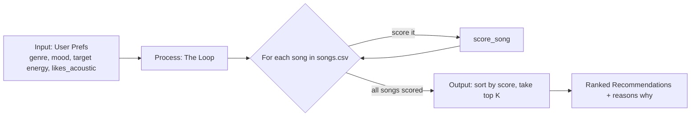

# 🎵 Music Recommender Simulation

## Project Summary

In this project you will build and explain a small music recommender system.

Your goal is to:

- Represent songs and a user "taste profile" as data
- Design a scoring rule that turns that data into recommendations
- Evaluate what your system gets right and wrong
- Reflect on how this mirrors real world AI recommenders

Replace this paragraph with your own summary of what your version does.

---

## How The System Works

From what I looked into, real recommenders like Spotify or YouTube mostly do two things: they look at what other people with similar taste liked (collaborative filtering), and they look at what a song actually sounds like (content-based filtering), then mix both together. My version is way smaller, so I'm only doing the content-based part. Instead of comparing users to other users, I just compare each song's stats to what one user says they like, and I give higher scores to songs that are closer to what they asked for, not just songs that are "higher energy" or whatever.

**Song features I'm using:**
- `genre` — matched exact, used more like a filter/bonus than a real "closeness" number
- `mood` — same, exact match bonus
- `energy` — closeness score vs the user's target energy
- `valence` — how positive/happy the song sounds
- `danceability` — how easy it is to move to
- `acousticness` — how "unplugged" vs produced/electronic it sounds
- (dropping `tempo_bpm` from the score itself since it basically tracks energy already and would just double count)

**UserProfile stores:**
- `favorite_genre`
- `favorite_mood`
- `target_energy` — the energy level they want, not just "give me high energy"
- `likes_acoustic` — a simple yes/no on acoustic songs

**How the Recommender scores a song:**
For the numeric stuff (like energy), I use `1 - abs(song_value - target_value)` so a song that lands right on what the user wants scores near 1, and it drops off the further away it gets in either direction. Genre and mood add a bonus on top if they match exactly. Then all of that gets added into one score per song.

**How I pick which songs to show:**
Once every song has a score, the Recommender sorts the whole list from highest to lowest and just takes the top `k`. That sorting/cutoff step is separate from the scoring itself — scoring only looks at one song at a time, ranking is what decides the final order and how many make the list.

**Data flow, the quick map:**



Basically: prefs come in once, then every song in the CSV gets judged one at a time against those prefs, and once they all have a score I sort and cut it down to the top K.

**Algorithm Recipe (finalized):**

I went with genre counting for more than mood, 2 to 1. Reasoning is a wrong genre feels like a bigger miss than a wrong mood — like if you want afrobeats and I hand you rock, that's way off, but if you want "romantic" and I hand you "playful" afrobeats, it's still kinda in the ballpark. Mood also just changes more day to day than genre does, so I didn't want it weighted the same.

- Genre match: `+2.0` if it's exact
- Mood match: `+1.0` if it's exact
- Energy closeness: up to `+1.0`, scaled by `1 - abs(song.energy - target_energy)` so close energy still gets partial credit instead of all-or-nothing
- Acoustic fit: `+0.5` if `acousticness` lines up with whether the user said they like acoustic stuff or not (small bonus, more of a tiebreaker)

Max possible score is 4.5. All of it just adds up into one number per song.

**Bias I'm expecting:**
Because genre is worth double mood, this thing probably over-favors genre matches even when the mood is way off. So a song could beat out a better mood fit just because the genre box got checked. Also since acoustic is only worth 0.5, it barely moves the ranking, so users who really care about acoustic vs not might feel like the system's ignoring them. And energy being a smooth score means a song that's just "fine" on everything can sometimes out-score a song that nails genre + mood but is a little off on energy.

---

## Getting Started

### Setup

1. Create a virtual environment (optional but recommended):

   ```bash
   python -m venv .venv
   source .venv/bin/activate      # Mac or Linux
   .venv\Scripts\activate         # Windows

2. Install dependencies

```bash
pip install -r requirements.txt
```

3. Run the app:

```bash
python -m src.main
```

### Running Tests

Run the starter tests with:

```bash
pytest
```

You can add more tests in `tests/test_recommender.py`.

---

## Sample Recommendation Output

Ran with `python -m src.main`, default profile is `favorite_genre=afrobeats, favorite_mood=romantic, target_energy=0.6, likes_acoustic=False`:

```
Loaded songs: 17

Top 5 Recommendations for afrobeats / romantic
==============================================

1. Essence — Wizkid ft. Tems
   Score:   4.45
   Reasons: genre match (+2.0); mood match (+1.0); energy similarity (+0.95); acoustic fit (+0.5)

2. Last Last — Burna Boy
   Score:   3.50
   Reasons: genre match (+2.0); energy similarity (+1.00); acoustic fit (+0.5)

3. Calm Down — Rema
   Score:   3.48
   Reasons: genre match (+2.0); energy similarity (+0.98); acoustic fit (+0.5)

4. HUMBLE. — Kendrick Lamar
   Score:   1.48
   Reasons: energy similarity (+0.98); acoustic fit (+0.5)

5. Night Drive Loop — Neon Echo
   Score:   1.35
   Reasons: energy similarity (+0.85); acoustic fit (+0.5)
```

**Screenshot or video** *(optional)*: <!-- Insert a screenshot or demo video link here -->

---

## Experiments You Tried

Use this section to document the experiments you ran. For example:

- What happened when you changed the weight on genre from 2.0 to 0.5
- What happened when you added tempo or valence to the score
- How did your system behave for different types of users

---

## Limitations and Risks

Summarize some limitations of your recommender.

Examples:

- It only works on a tiny catalog
- It does not understand lyrics or language
- It might over favor one genre or mood

You will go deeper on this in your model card.

---

## Reflection

Read and complete `model_card.md`:

[**Model Card**](model_card.md)

Write 1 to 2 paragraphs here about what you learned:

- about how recommenders turn data into predictions
- about where bias or unfairness could show up in systems like this


